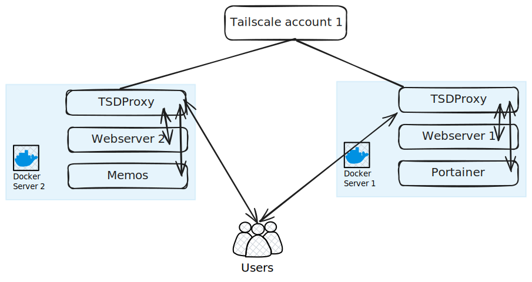

## Description

In this scenario, we will have:

1. two TSDProxy instances
2. two Docker servers running
3. one Tailscale provider.

## Scenario



### Server 1

```yaml  {filename="docker-compose.yaml"}
services:
  tsdproxy:
    image: tsdproxy:latest
    user: root
    ports:
      - "8080:8080"
    volumes:
      - <PATH_TO_CONFIG>:/config
      - data:/data
      - /var/run/docker.sock:/var/run/docker.sock
    restart: unless-stopped

  webserver1:
    image: nginx
    ports:
      - 81:80
    labels:
      - tsdproxy.enable=true
      - tsdproxy.name=webserver1

  portainer:
    image: portainer/portainer-ee:2.21.4
    ports:
      - "9443:9443"
      - "9000:9000"
      - "8000:8000"
    volumes:
      - portainer_data:/data
      - /var/run/docker.sock:/var/run/docker.sock
    labels:
      tsdproxy.enable: "true"
      tsdproxy.name: "portainer"
      tsdproxy.container_port: 9000

volumes:
  data:
  postainer_data:
```

### Server 2

```yaml  {filename="docker-compose.yaml"}
services:
  tsdproxy:
    image: tsdproxy:latest
    user: root
    ports:
      - "8080:8080"
    volumes:
      - <PATH_TO_CONFIG>:/config
      - data:/data
      - /var/run/docker.sock:/var/run/docker.sock
    restart: unless-stopped

  webserver2:
    image: nginx
    ports:
      - 81:80
    labels:
      - tsdproxy.enable=true
      - tsdproxy.name=webserver2

  memos:
    image: neosmemo/memos:stable
    container_name: memos
    volumes:
      - memos:/var/opt/memos
    ports:
      - 5230:5230
    labels:
      tsdproxy.enable: "true"
      tsdproxy.name: "memos"
      tsdproxy.container_port: 5230

volumes:
  memos:
```

## TSDProxy Configuration of SRV1

```yaml  {filename="/config/tsdproxy.yaml"}
defaultProxyProvider: default
docker:
  srv1: 
    host: unix:///var/run/docker.sock
    defaultProxyProvider: default
tailscale:
  providers:
    default: 
      authKey: "SAMEKEY"
```

## TSDProxy Configuration of SRV2

```yaml  {filename="/config/tsdproxy.yaml"}
defaultProxyProvider: default
docker:
  srv2: 
    host: unix:///var/run/docker.sock
    defaultProxyProvider: default
tailscale:
  providers:
    default: 
      authKey: "SAMEKEY"
```
