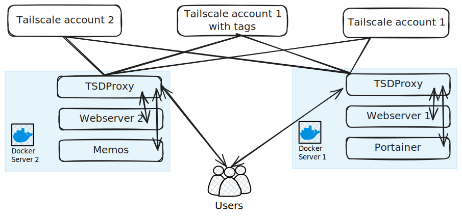

## Description

In this scenario, we will have :

1. two Docker servers.
2. one TSDProxy instance in each docker server.
3. three Tailscale providers.
4. Containers in SRV1 will use the 'default' provider.
5. Containers in SRV2 will use the 'account2' provider.
6. webserver1 is running in SRV1 but will use the 'withtags' provider.
7. memos is running in SRV2 but will use the 'withtags' provider.

## Scenario



### Server 1

```yaml  {filename="docker-compose.yaml"}
services:
  tsdproxy:
    image: tsdproxy:latest
    user: root
    ports:
      - "8080:8080"
    volumes:
      - <PATH_TO_CONFIG>:/config
      - data:/data
      - /var/run/docker.sock:/var/run/docker.sock
    restart: unless-stopped

  webserver1:
    image: nginx
    ports:
      - 81:80
    labels:
      tsdproxy.enable: true
      tsdproxy.name: webserver1
      tsdproxy.provider: withtags
    

  portainer:
    image: portainer/portainer-ee:2.21.4
    ports:
      - "9443:9443"
      - "9000:9000"
      - "8000:8000"
    volumes:
      - portainer_data:/data
      - /var/run/docker.sock:/var/run/docker.sock
    labels:
      tsdproxy.enable: true
      tsdproxy.name: portainer
      tsdproxy.container_port: 9000

volumes:
  data:
  portainer_data:
```

### Server 2

```yaml  {filename="docker-compose.yaml"}
services:
  webserver2:
    image: nginx
    ports:
      - 81:80
    labels:
      - tsdproxy.enable=true
      - tsdproxy.name=webserver2

  memos:
    image: neosmemo/memos:stable
    container_name: memos
    volumes:
      - memos:/var/opt/memos
    ports:
      - 5230:5230
    labels:
      tsdproxy.enable: true
      tsdproxy.name: memos
      tsdproxy.container_port: 5230
      tsdproxy.provider: withtags

volumes:
  memos:
```

## TSDProxy Configuration of SRV1

```yaml  {filename="/config/tsdproxy.yaml"}
defaultproxyprovider: default
docker:
  srv1: 
    host: unix:///var/run/docker.sock
    defaultproxyprovider: default
tailscale:
  providers:
    default: 
      authkey: "sdfsdgsdfgdfg"
    withtags:
      authkey: "jujgnndvds"
    account2:
      authkey: "nnnnnnndndnddd"
```

## TSDProxy Configuration of SRV2

```yaml  {filename="/config/tsdproxy.yaml"}
defaultproxyprovider: default
docker:
  srv2: 
    host: unix:///var/run/docker.sock
    defaultproxyprovider: account2
tailscale:
  providers:
    default: 
      authkey: "sdfsdgsdfgdfg"
    withtags:
      authkey: "jujgnndvds"
    account2:
      authkey: "nnnnnnndndnddd"
```
